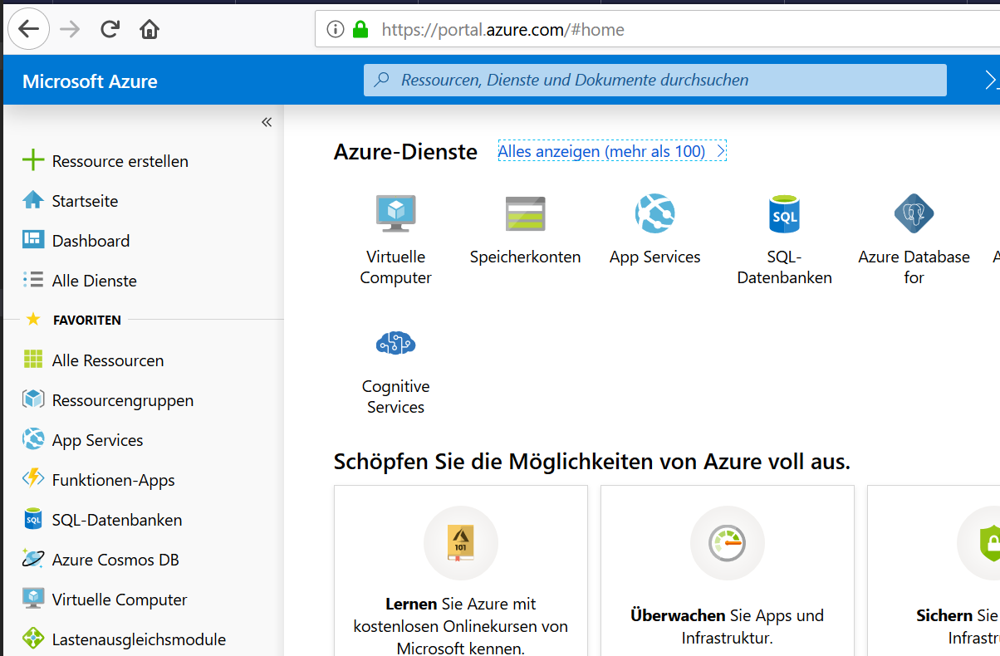
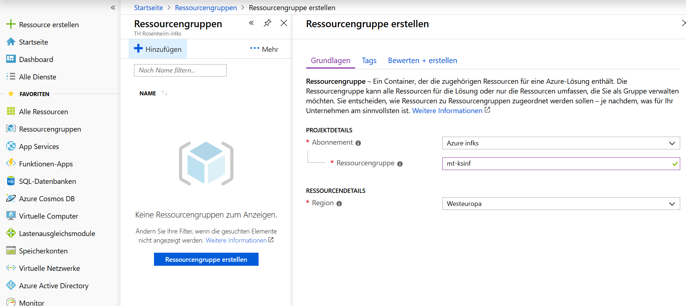
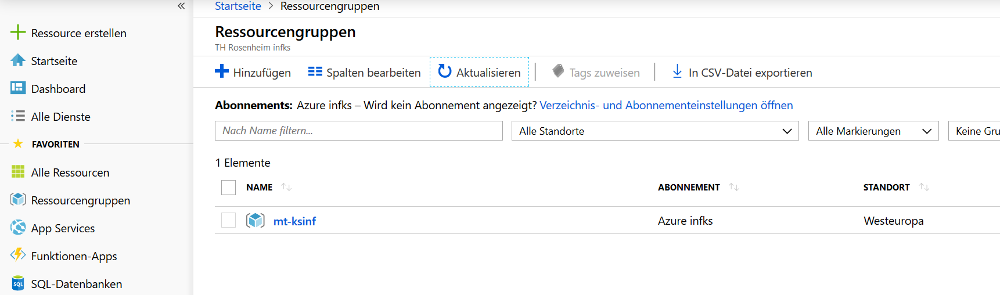

_Übungsaufgabe zur Veranstaltung [IT
Systeme](https://hsro-wif-it.github.io) im [Bachelorstudiengang
Wirtschaftsinformatik](https://www.th-rosenheim.de/technik/informatik-mathematik/wirtschaftsinformatik-bachelor/) an der [Hochschule Rosenheim](http://www.th-rosenheim.de)._

# 12 - Cloud

Diese Übung behandelt speziell das Thema _Cloud_ und _Virtualisierung_. Dabei geht es darum mit Azure ein wenig vertraut zu werden.

> Note: **Diesmal gibt es _keine_ Musterlösung!**

## Aufgabe 1: Azure Setup

> NOTE: Evtl. sieht das Azure Portal etwas verändert aus. Funktional sollte es aber mit der Übung passen.

Zunächst müssen Sie im Azure AD (Active Directory) der Azure Subscription hinzugefügt werden.

Wir nutzen in dieser Übung eine Azure Subscription gemeinsam und jeder sollte in seiner eigenen Ressourcegruppe arbeiten.

- Bitte folgen sie dem Link in der EMail und validieren bitte den Azure-Zugang.

- Idealerweise sollten sie auf dem [Azure Portal](https://portal.azure.com/) landen.

- Zum Test legen sie bitte eine neue _Ressourcegruppe_ mit dem Name **<ihr_kürzel>-ISWIF** an. Als _Region_ bitte **Westeuropa** wählen.

 

- Am unteren Rand nicht vergessen **Bewerte + erstellen** zu klicken. 

- Danach sollte ihre Ressourcengruppe in der Liste der Ressourcengruppen erscheinen.

> NOTE: In folgenden Aufgaben bitte darauf achten, dass Sie diese Ressourcegruppe verwenden. Damit lassen sich verwendete Ressourcen einfacher löschen und verwalten.

## Aufgabe 2: VM erstellen

> Bitte verwenden Sie im folgenden die kleinst mögliche Größe für die VM. Ausserdem ignorieren Sie in den Aufgaben das 'Bereinigen der Ressourcen', da wir die Ressourcen in der nächsten Woche noch benötigen. ABER bitte stoppen Sie die VM!!!!

Führen sie bitte die folgenden Lernprogramme auf Azure aus:

1. [Erstellen eines virtuellen Linux-Computers im Azure-Portal](https://docs.microsoft.com/de-de/azure/virtual-machines/linux/quick-create-portal)

2. [Erstellen einer virtuellen Windows-Maschine im Azure-Portal](https://docs.microsoft.com/de-de/azure/virtual-machines/windows/quick-create-portal)

**Fertig!!!**